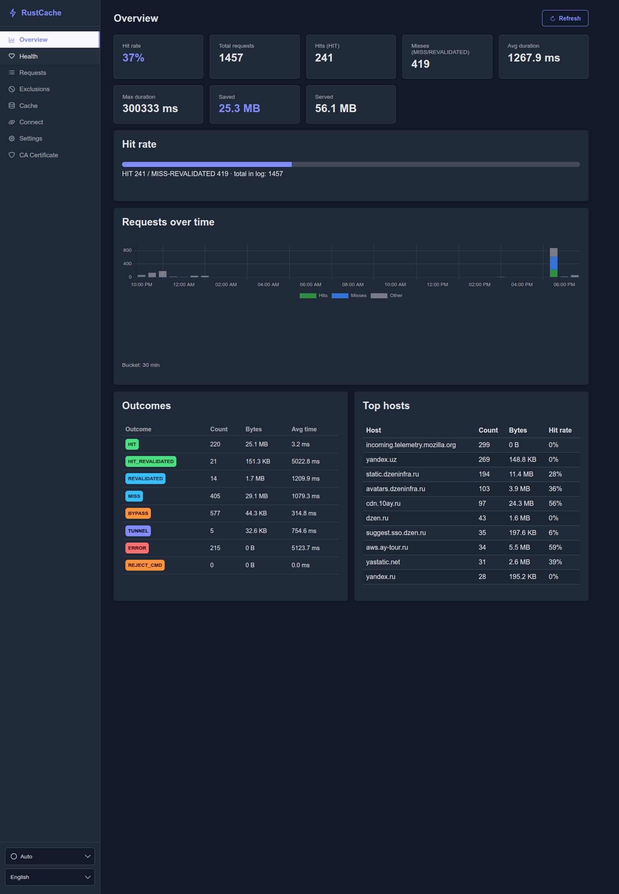
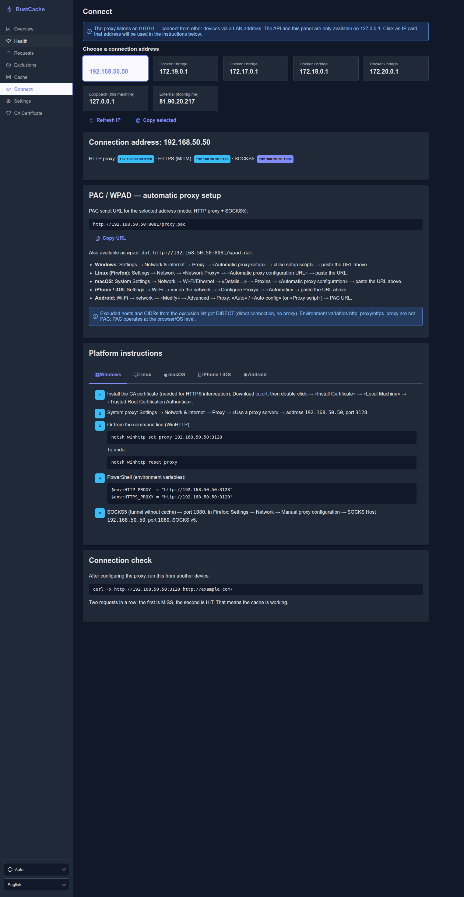
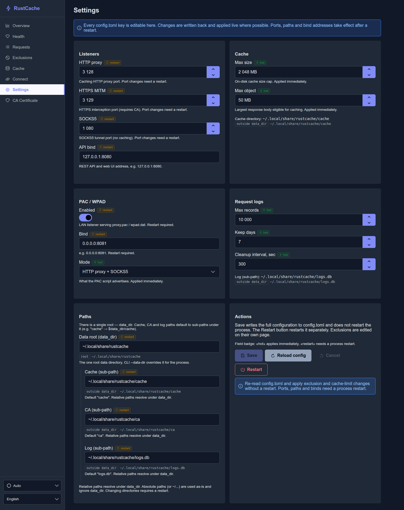
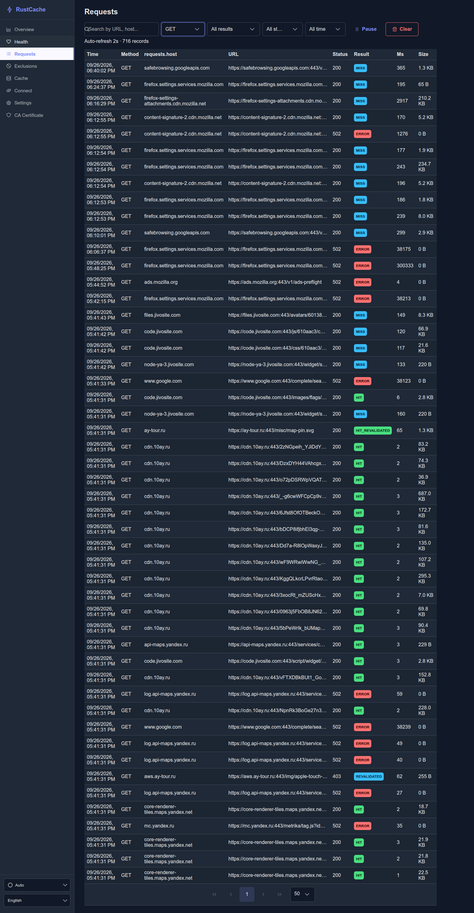

# RustCache

Caching HTTP/HTTPS proxy (MITM + disk/mem cache) with a SOCKS5 tunnel and a local REST API + Web UI.

## Features

- **HTTP proxy** on `:3128` — absolute-form GET/HEAD served from cache (mem → disk), miss/revalidate via origin
- **HTTPS MITM** on `:3129` — on-the-fly leaf certs signed by a local CA; excluded hosts are raw-tunneled
- **SOCKS5** on `:1080` — CONNECT-only tunnel (no caching)
- **REST API + SPA** on `127.0.0.1:8080` — health, request log, cache, exclusions, config, CA download
- **PAC / WPAD** on `:8081` (optional) — LAN-facing, serves only PAC files

## Screenshots

**Overview** — hit rate, traffic over time, outcomes, top hosts



**Requests** — live request log with HIT / MISS / ERROR badges



**Settings** — every `config.toml` key from the UI (hot / restart badges)



**Connect** — LAN addresses, PAC / WPAD URL, per-platform setup



## Default ports

| Port | Service |
|------|---------|
| 3128 | HTTP proxy |
| 3129 | HTTPS MITM proxy |
| 1080 | SOCKS5 |
| 8080 | API / Web UI (127.0.0.1) |
| 8081 | PAC (0.0.0.0, optional) |

## Build

```bash
# UI (required before embed-ui)
npm --prefix web install
npm --prefix web run build

# Binary (embeds web/dist)
cargo build --release --features embed-ui

# Or without embedded UI (serve web/dist separately)
cargo build --release
```

## Run

```bash
cargo run -p rustcache -- run --config config.toml
# or with an explicit data root
cargo run -p rustcache -- run --data-dir ~/.local/share/rustcache
```

Missing `config.toml` falls back to built-in defaults. Copy `config.example.toml` as a template.

## Development

```bash
cargo fmt --check
cargo clippy --workspace -- -D warnings
cargo test --workspace

npm --prefix web run dev      # Vite + HMR, proxies /api → :8080
npm --prefix web run lint
npm --prefix web run build
```

## Translations

Web UI is available in English (`en`, source) and Russian (`ru`). Locale files live in `web/src/i18n/locales/*.json` (i18next, nested JSON).

Translations are managed on Weblate: **https://weblate.traineratwot.site/projects/rustcache/**

- Component: [`rustcache/web-ui`](https://weblate.traineratwot.site/projects/rustcache/web-ui/)
- Source strings: `web/src/i18n/locales/en.json`
- Add a language or fix a string in the Weblate UI — no need to open a PR for pure translation changes

[](https://weblate.traineratwot.site/engage/rustcache/)

## Layout

| Path | Role |
|------|------|
| `crates/rustcache-core` | Cache key/disk/mem, certs, origin fetch, exclusions, request log |
| `crates/rustcache` | CLI, listeners (http/mitm/socks5), axum API, config, engine |
| `web/` | React 19 + TypeScript SPA |
| `docs/plans/` | Historical implementation plans (superseded by code where they drifted) |

## Data locations

| What | Where |
|------|-------|
| Config | `config.toml` (or `--config`) |
| Data root | `data_dir` (default `~/.local/share/rustcache`) |
| Cache | `$data_dir/cache` |
| Root CA | `$data_dir/ca/` (`ca.key` mode 0600) |
| Request log | `$data_dir/logs.db` (SQLite WAL) |

## Smoke test

```bash
bash scripts/smoke.sh
# or manually:
curl -x http://127.0.0.1:3128 http://example.com/   # twice: MISS then HIT
curl --cacert ~/.local/share/rustcache/ca/ca.crt -x http://127.0.0.1:3129 https://example.com/
curl http://127.0.0.1:8080/api/stats
```
